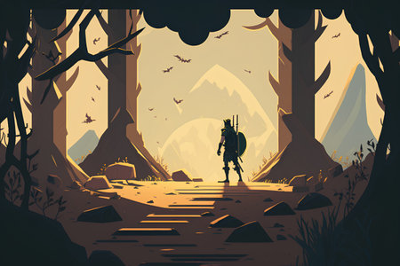

# Challenge : Moteur de jeu d’aventure - Les structure en graphs

## Dates : du 20/10/24 au 03/11/24

## Difficulté : moyen

## Technologies cibles : 
- Java 17+ ou Kotlin

## Description
Ce challenge s'inspire des célèbres livres dont vous êtes le héros où le lecteur prend des **décisions** qui influencent directement le déroulement de l'histoire. 
Vous devez créer un **jeu d'aventure basé** sur du texte dans lequel les joueurs peuvent naviguer dans une histoire en faisant des choix. Le jeu peut être aussi simple ou complexe que vous le souhaitez, en fonction de votre niveau de compétences. Ce projet combine des éléments de narration et de codage.

## Objectif
Vous modéliserez cette aventure comme un **graphe** (structure de donnée de type graphe) où chaque **nœud** représente une situation et chaque **arête** un choix menant à un autre nœud. Vous pouvez laisser libre cours à votre imagination pour développer un scénario captivant avec de multiples ramifications.

À différents moments du jeu, les joueurs doivent se voir proposer des choix. Ces choix influencent l'orientation de l'histoire.

Vous pouvez simplement proposer des choix à 2 options (genre Oui - Non) ou aller plus loin, comme par exemple:

- Inclure un système d'inventaire, où les joueurs peuvent collecter des objets ou gagner des attributs qui ont un impact sur l'issue du jeu.
- Introduire des événements ou des rencontres aléatoires pour ajouter de l'imprévisibilité et de l'excitation au jeu.

Mettez en place des scénarios de **fin de partie**, de sorte que si les joueurs font certains mauvais choix, la partie s'arrête.

Il est important de noter que le scénario n’est pas linéaire et peut également boucler selon les événements. 

## Exigences
- Créer une structure de graphe représentant l'ensemble des choix disponibles et leurs conséquences :
[Documentation sur les Graphs](https://www.geeksforgeeks.org/graph-data-structure-and-algorithms/). Nous vous laissons le soin de choisir comment.
- Chaque nœud du graphe doit contenir un texte narratif et une liste de choix possibles.
- Implémenter un système permettant au joueur d'entrer ses choix et de naviguer dans l'histoire.
- Il doit y avoir plusieurs fins possibles, en fonction des choix effectués.

### Exemple d’histoire: "La quête de la relique perdue"

Dans un monde rempli de magie et de mystère, vous êtes un jeune aventurier en herbe. Les légendes parlent d'un puissant artefact connu sous le nom d'"orbe d'éternité", dont on dit qu'il confère à son possesseur un pouvoir inimaginable et la capacité de façonner l'avenir. L'orbe a été perdu pendant des siècles, caché dans le perfide Labyrinthe des Ombres, un endroit plein de dangers et de secrets.

Un jour, vous recevez un message énigmatique d'un vieux sage, Arion le Sage. Il croit que vous êtes l'élu destiné à trouver l'orbe et à rétablir l'équilibre du monde. Armé d'une épée rouillée, vous vous lancez dans un périlleux voyage à la recherche de la relique perdue.

#### Gameplay
- Vous commencez dans le paisible village d'Eldoria, où Arion le Sage vous donne votre premier indice.
- Votre voyage vous mène à travers de sombres forêts, des grottes mystérieuses et d'anciennes ruines.
- En chemin, vous rencontrerez des défis, des énigmes et des adversaires.
- Vous devez prendre des décisions cruciales, telles que le chemin à suivre ou la façon de traiter avec des alliés et des ennemis potentiels.
- Vos actions et vos choix influencent l'issue de votre quête.

#### Fins possibles
1. Victoire triomphante: Vous trouvez l'orbe d'éternité, utilisez son pouvoir pour le bien de tous et retournez à Eldoria en héros, apportant la prospérité à votre peuple.
2. Échec tragique: Vous rencontrez une fin malheureuse dans le Labyrinthe des Ombres, et le monde reste dans la tourmente.
3. Fin ambiguë: Vous découvrez l'orbe, mais le jeu laisse les conséquences de son utilisation ouvertes, ce qui permet au joueur de les interpréter.

#### Lieux clés
1. Village d'Eldoria: Votre point de départ et la maison d'Arion le Sage.
2. Les Bois Chuchotants: Une forêt sombre et enchantée qui recèle de nombreux secrets.
3. Cavernes de cristal: Un réseau de grottes labyrinthique rempli de pierres précieuses, de pièges et de dangers.
4. Temple des Anciens: Une structure ancienne avec des inscriptions mystérieuses qui pourraient contenir des indices sur l'emplacement de l'orbe.
5. Labyrinthe des Ombres: Le dernier endroit, le plus dangereux, où l'orbe est censé être cachée.

#### Exemple de décision: Le bois Chuchotants
Vous avez pénétré dans la forêt dense des Chuchoteurs, où des voix sinistres et des ombres étranges vous entourent. Alors que vous vous enfoncez dans la forêt, vous tombez sur une bifurcation. Le chemin de gauche semble bien tracé et sûr, tandis que le chemin de droite est envahi par la végétation et semble mener plus profondément au cœur de la forêt. Votre instinct vous dit que la réponse est peut-être cachée dans les profondeurs de la forêt, mais c'est aussi là que le danger est le plus grand.

#### Décision
1. Prendre le chemin de gauche : Vous décidez de jouer la carte de la sécurité et de vous en tenir au chemin le plus fréquenté. C'est un chemin plus lent mais plus sûr à travers les bois.
2. Prenez le chemin de droite : Vous suivez votre instinct et empruntez le sentier envahi par la végétation, pensant qu'il vous rapprochera de la relique cachée, mais qu'il vous mettra aussi en danger.

#### Conséquences
- Si vous choisissez le chemin de gauche, vous progressez lentement mais vous évitez les dangers immédiats, et vous rencontrerez peut-être un habitant de la forêt qui vous fournira de précieuses informations.
- Si vous choisissez le chemin de droite, vous vous aventurez plus profondément dans les Bois Chuchotants, vous affrontez des obstacles difficiles et vous découvrez un indice caché qui vous rapproche de l'emplacement de l'orbe, mais vous risquez aussi de rencontrer des créatures menaçantes.

## Bonus - ASCII Art
Pour rendre le jeu plus attrayant sur le plan visuel, vous pouvez inclure des images ASCII pour illustrer des scènes ou des personnages.

## Critères d'évaluation

- Respect des principes fondamentaux de la Programmation Objet 
- Bon usage de la structure en Graph
- Interactions avec l’utilisateur intuitives (questions - réponses)
- Complexité (éléments de Gameplay) et originalité
- Bonus 1 : ASCII ART

## Récompense
- Vainqueur : 10 pts
- 2ème : 5 pts
- 3ème : 2 pts

Rappel: Les participants accumulent des points en fonction de leur performance dans les challenges. Ces points peuvent être convertis en cartes cadeaux Prezzy, utilisables pour des achats en ligne ou en magasin dans n'importe quelle devise.
